# The 2026–27 El Niño on CUGN Line 66.7 — September 2026 report

**Report date:** 2026-09-03 · **Line:** CalCOFI/CUGN Line 66.7, off Monterey Bay ·
**Data cutoff:** delayed-mode glider data through 2026-06-09; real-time glider data
through 2026-09-03; climate indices as of 2026-09-03 and satellite SST through 2026-09-02 (see §10).
**Authors:** Generated by JXP and Claude. **Audience:** Dan Rudnick and colleagues.
**Series:** first of a monthly series; figures in `figs/2026_09/`, sources in
`sources.md` / `sources.bib` (citation keys in brackets).

---

## 1. Summary

- **The equatorial Pacific is in a rapidly strengthening El Niño.** The
  May–July 2026 ONI is +1.39 °C; NOAA gives a >90 % chance of a very strong
  event (ONI ≥ +2.0) this winter and a 69 % chance that October–December exceeds
  every event since 1950. The IRI plume peaks in October–December 2026, with
  El Niño persisting through spring 2027 (§2).
- **Line 66.7 is already anomalously warm, but from the marine heatwave, not
  yet from El Niño.** The Line 66.7 Temperature Index (10–100 m, 0–200 km
  offshore, 3-month mean) has been positive continuously since **July 2025**.
  It peaked at **+1.90 °C in April 2026**, exceeding the Line 66.7 peak of the
  2015–16 El Niño (+1.78 °C, February 2016), and stands at **+1.32 °C** in the
  latest 3-month window centred on 24 August 2026 (§4, Figs 1, 4, 7). The
  equatorial signal has not yet arrived in the quantities that carry it to the
  coast: sea level is only +5–6 cm, the coastal Kelvin wave is still south of
  California, and summer upwelling has been above normal (§6, §8). The
  warming so far is the marine heatwave, now easing at the surface.
- **The warmth is no longer surface-trapped.** At the April 2026 peak the
  inshore anomaly averaged **+2.4 °C at 10 m, +1.0 °C at 100 m and +0.5 °C at
  200 m**, and in July–August 2026 it still exceeds +0.5 °C to below 200 m,
  deeper than at the 2015–16 El Niño peak (120 m) and far deeper than the
  2014–15 Blob (70 m). Isopycnals inshore are **20–30 m deeper than the
  2008–2013 norm** (σθ = 26.0: +23 m). The latest complete transect
  (24 July–10 August) shows +3–5 °C in a 20–60 m warm layer under a thin,
  near-normal upwelled surface layer inshore, and +0.5–1 °C over the whole
  water column within ~100 km of the coast (§4.4).
- **Oxygen tells a different story on isopycnals than on depth surfaces.** On
  depth surfaces the upper-100 m oxygen anomaly is near zero (+0.7 µmol kg⁻¹).
  On isopycnals it is strongly negative, **−30 µmol kg⁻¹ on σθ = 25.5 and
  −19 on σθ = 26.0**, i.e. the water occupying each density surface inshore is
  markedly lower in oxygen than the 2017–2024 norm, consistent with a more
  southern, spicier source (§5, Fig. 6).
- **What to watch.** The coastal Kelvin wave forecast to reach central
  California in October; a rise in coastal sea level beyond the current
  +5–6 cm; a further deepening of the σθ = 26.0 surface; a reversal of the
  decline in the index since April; and whether the low-oxygen, deep-warm
  inshore signature strengthens, which would point to an intensified poleward
  undercurrent. Line 66.7 enters the El Niño winter warmer, and warm to
  greater depth, than at the same stage of any event in the glider record
  (Fig. 7, Table 1).

## 2. ENSO state and forecast

**Status.** NOAA's Climate Prediction Center (CPC) has been in *El Niño Advisory*
since its June 2026 update, after a weak La Niña decayed to neutral conditions in
early 2026 and the equatorial Pacific transitioned rapidly through the spring
[@cpc2026aug; @noaa2026elninoforms]. In the 13 August 2026 diagnostic discussion the
July monthly Niño indices were +1.4 °C (Niño-3.4), +1.7 °C (Niño-3) and +2.9 °C
(Niño-1+2), with subsurface temperature anomalies reaching +10 °C along a
deeper-than-normal thermocline in the eastern equatorial Pacific
[@cpc2026aug]. The official Oceanic Niño Index (ONI) for May–July 2026 is
+1.39 °C, already at the "moderate" threshold after a season at +0.5 in
March–May (Fig. 1, black).

**Forecast.** CPC gives a greater-than-90 % chance of a *very strong* event
(ONI ≥ +2.0 °C) during fall and winter 2026–27 and a 69 % chance that the
October–December ONI reaches or exceeds +2.5 °C, which would be the strongest
event in the 1950–present record [@cpc2026aug; @cpc2026strengths]. The IRI
plume of 19 August 2026 has 25 of 26 models above +2.0 °C from August–October
through December–February, with the peak in October–December and several
dynamical models above +3.0 °C; El Niño probabilities stay at 100 % through
February–April 2027 and 97 % in March–May 2027 [@iri2026aug]. The event is
therefore expected to peak during the Northern Hemisphere winter and persist
through spring 2027.

**Character.** The onset was late relative to 1997 and 2015 but has been
"catching up" [@nasa2026kelvin]: Sentinel-6 altimetry tracked a
downwelling equatorial Kelvin wave from March that raised sea level off Peru by
more than 15 cm by mid-May. A spring pattern of warm anomalies ringing the
tropical Pacific has been identified as a precursor that elevates the 2026/27
event [@lian2026olar]; by contrast a climate-network forecast issued in
February still favoured ENSO-neutral, and gave an Eastern-Pacific type only
conditionally on onset [@ludescher2026arxiv], an illustration of how quickly
the spring transition outran the statistical schemes. An Eastern-Pacific event
is the type whose coastal expression along the Americas, via
poleward-propagating coastal Kelvin waves, is strongest; the first such wave, which raised sea level by 9–14
inches in Central America in late August, is forecast to reach San Francisco in
early-to-mid October 2026 [@sfchronicle2026kelvin; @gizmodo2026sealevel].

**Why this matters for Line 66.7.** The California Current response to a strong
El Niño arrives through two routes: the oceanic route, in which coastal Kelvin
waves deepen the thermocline and nutricline, raise coastal sea level and
strengthen poleward flow, and the atmospheric route, in which a deepened
Aleutian Low weakens upwelling-favourable winds and adds anomalous
downwelling and poleward wind stress [@jacox2016elnino; @rudnick2017climatology].
During 2015–16 both routes produced upper-ocean warming of 1–3 °C on the CUGN
lines, on top of the pre-existing 2014–15 "Blob" anomaly [@zaba2016warming;
@rudnick2017climatology]. The 2026–27 event again arrives on top of a
pre-existing marine heatwave (Section 6), so the question this report tracks
is when, and how far into the water column, the El Niño signal becomes
distinguishable from the heatwave already in place.

## 3. Line 66.7 sampling during the event

The delayed-mode record (SprayData ERDDAP `binnedCUGN66`) holds **62,028
profiles from 2007-04-19 to 2026-06-09** (66 missions; 34 profiles lacking a
time or position were dropped). Since the previous local copy ended in March
2023 it adds missions 54–65, i.e. the entire heatwave period. The mission at
sea, `sp025-20260611T1755`, contributes **757 real-time profiles from
2026-06-11 to 2026-09-03** (Glider DAC, Level 2, QARTOD-flagged; flags 1 and 2
kept). Earlier Line 66.7 missions during the event were `sp055-20250806T2212`,
`sp025-20251118T1703`, `sp203-20260203T1905` and `sp055-20260225T2146`; all
are now in the delayed-mode record.

Coverage is essentially continuous since mid-2025 (Fig. 4, middle panel).
Because the index averages only the inshore 200 km, 10-day windows in which
the glider is beyond 200 km appear as gaps in the raw series (e.g. early July
and mid-to-late August 2026); the 3-month running mean bridges them. The
harmonic seasonal fit has valid coefficients out to 400 km offshore at all
depths.

## 4. Temperature

### 4.1 The Line 66.7 Temperature Index (Fig. 1)

The index is the anomaly from the 2008–2013 seasonal climatology averaged over
10–100 m and 0–200 km, smoothed with a 3-month running mean, plotted with the
official ONI and, for comparison, the Scripps SCTI for Line 90 (§10). Over
2007–2026 it tracks the SCTI closely and follows the ONI through the 2009–10
and 2015–16 El Niños and the 2010–11 La Niña, with two large departures from
ENSO: the 2014–15 Blob, and a warm episode in late 2017 during La Niña that
holds the record of the smoothed index (+2.20 °C, November 2017, driven by a
few very warm 10-day windows with anomalies of +3–5 °C at 50 m).

The current excursion began in **July 2025**, a year before the equatorial
warming: the index crossed +1 °C in November 2025 and +1.5 °C in February
2026, peaked at **+1.90 °C on 16 April 2026**, and has since relaxed to
**+1.32 °C** (window centred 24 August 2026; the unsmoothed 10-day value for
the last window, 31 profiles ending 3 September, is +1.10 °C). The SCTI on
Line 90 reached +1.27 °C at the end of June 2026, so the warming is coherent
along the coast.

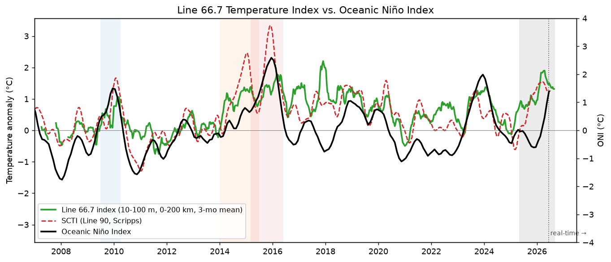
*Fig. 1. Line 66.7 Temperature Index (green; 10–100 m, 0–200 km, 3-month running
mean) with the official ONI (black, right axis) and the Scripps SCTI for Line 90
(red dashed). Shading marks the comparison events of §7; the dotted line marks the
start of real-time data.*

### 4.2 Cross-shore structure (Fig. 2)

The 10–100 m anomaly as a function of distance and time shows the 2025–26
warmth extending across the full 400 km of the line, as in 2014–16 and
2018–19, with the largest values inshore of ~150 km in spring 2026 and a
tendency for the offshore half to warm first in mid-2025. The strongest
single 10-day bin in 2026 is **+3.9 °C at 10 m, 55 km offshore, in mid-June
2026**.

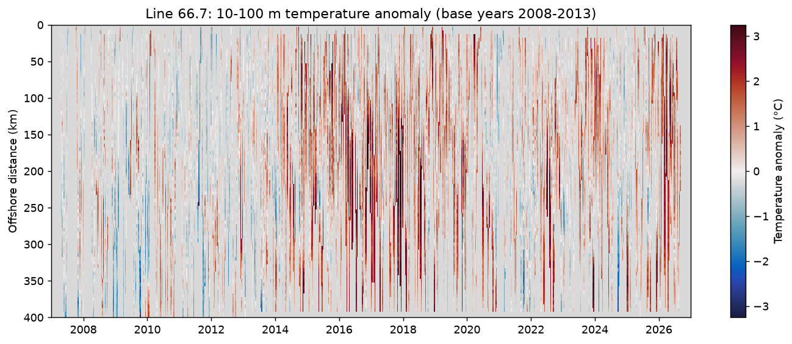
*Fig. 2. 10–100 m mean temperature anomaly on Line 66.7 versus offshore distance
and time, 2007–2026 (10-day × 5-km bins; grey = no glider in the bin).*

### 4.3 Vertical structure (Fig. 3 and Fig. 4)

Inshore of 200 km the largest anomalies, 2–4 °C, sit above ~80 m throughout
2025–26 (Figs 3, 4), but the event has a deep component that the Blob lacked.
Averaged over ±45 days around the April 2026 index peak, the inshore anomaly is
+2.4 °C at 10 m, **+1.0 °C at 100 m and +0.5 °C at 200 m**, and stays above
+0.5 °C down to ~230 m; the corresponding numbers at the 2015–16 peak were
+2.0, +0.8, +0.3 °C and 120 m, and at the 2014–15 Blob peak +2.7, +0.1, +0.2 °C
and 70 m (Table 1). In July–August 2026 the deep warmth persists (+0.8 °C at
100 m, +0.5 °C at 200 m) while the surface layer has cooled. Consistent with
this, the isopycnals inshore are depressed: for June–September 2026 the
σθ = 25.5, 26.0 and 26.5 surfaces lie **18, 23 and 31 m deeper** than the
2008–2013 seasonal norm. A depressed thermocline is the oceanic signature of
El Niño at the coast (§2), but it is also produced by a strengthened
California Undercurrent or a year of accumulated surface heat mixing down; the
oxygen anomalies on isopycnals (§5) favour an advective, poleward-flow
contribution. Distinguishing the arrival of the equatorial Kelvin signal from
this pre-existing deep warmth is the central task of the next reports.

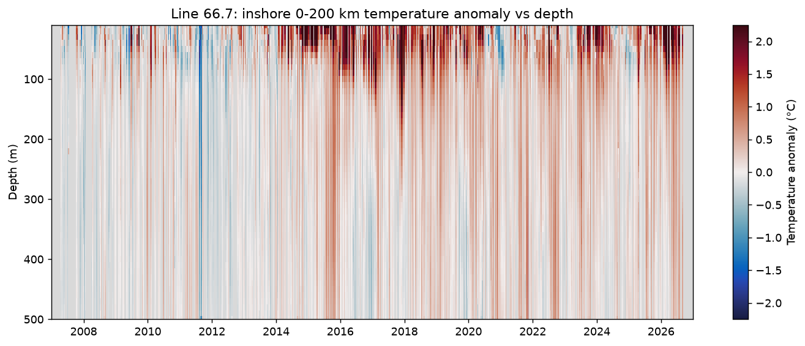
*Fig. 3. Inshore (0–200 km) mean temperature anomaly versus depth and time,
2007–2026.*

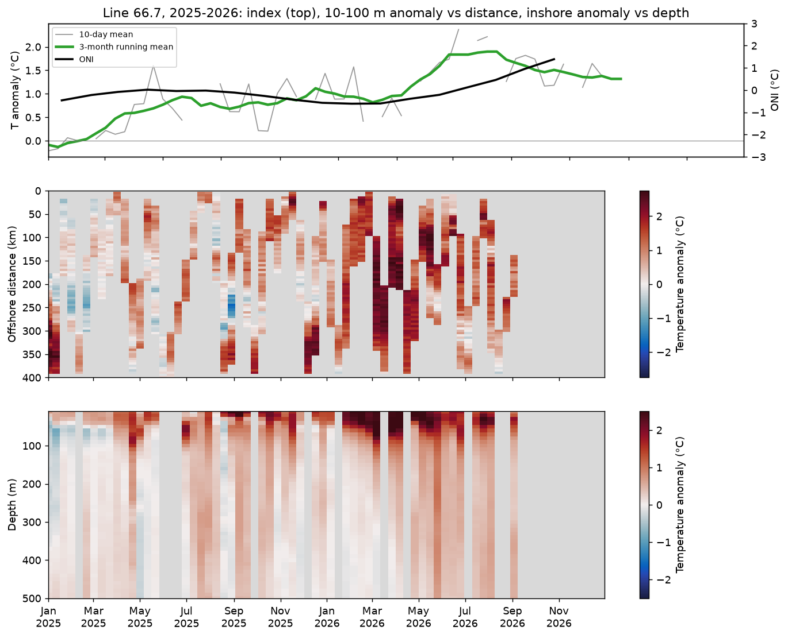
*Fig. 4. 2025–2026 detail: index (top; grey = 10-day means, green = 3-month mean,
black = ONI), 10–100 m anomaly versus distance (middle) and inshore anomaly versus
depth (bottom).*

### 4.4 The latest transect (Fig. 5)

The most recent complete leg of `sp025` ran **offshore from 22 km to 386 km
between 24 July and 10 August 2026 (149 profiles)**; the glider then turned
inshore and had reached 142 km by 3 September, so the ongoing leg is not yet
complete and its data enter Fig. 4 only. The section (Fig. 5) shows a
13–19 °C surface layer over a sharp thermocline; the σθ = 25 surface lies at
40–70 m and σθ = 26.0 at 110–140 m, with σθ = 26.5 sloping down toward the
coast inside 100 km, the signature of the poleward undercurrent. The anomaly
field is positive almost everywhere: **+1.1 °C averaged over 10–100 m and
+0.45 °C averaged over 100–500 m**, with a maximum of **+4.7 °C at 40 m**. The
warmest anomalies form a subsurface layer at 20–60 m inshore of ~150 km,
capped within ~40 km of the coast by a thin, near-normal surface layer, i.e.
late-summer upwelling has cooled the top few tens of metres over a warm layer
that it did not reach. Below the thermocline the anomaly is +0.5–1 °C over the
whole 100–500 m column inside ~100 km, coinciding with the downward-sloping
deep isopycnals of the undercurrent, and weakly negative (−0.5 °C) at 80–200 m
offshore of 300 km.

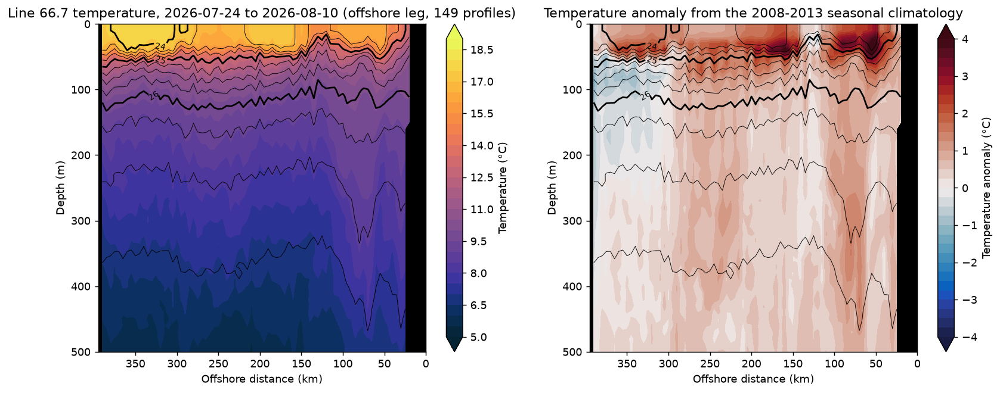
*Fig. 5. Latest complete transect of the active mission: temperature (left) and
anomaly from the 2008–2013 seasonal climatology (right) with σθ contours (0.25
kg m⁻³; integers heavy). Offshore is to the left. Black = no data.*

## 5. Dissolved oxygen (Fig. 6)

Oxygen anomalies are relative to a **2017–2024** seasonal climatology (the
sensor record starts in 2017), so they measure departures from an already-warm
decade. Two views are shown for the inshore 200 km: on depth surfaces and on
isopycnals (σθ 25.0–27.0, TEOS-10).

On depth surfaces the upper-100 m oxygen index is close to normal (**+0.7
µmol kg⁻¹**, window centred 24 August) after a strongly negative 2025
(−25 µmol kg⁻¹ in late spring 2025) and a brief positive excursion in early
2026. Below the surface layer the recent (June–September 2026) mean anomalies
are −1 to −5 µmol kg⁻¹ from 100 to 400 m.

On isopycnals the picture is different and, we think, more informative:
**−30 µmol kg⁻¹ on σθ = 25.5, −19 on 26.0 and −10 on 26.5** for June–September
2026, and negative on all upper isopycnals since late 2024. Because a warm
anomaly deepens the isopycnals, low-oxygen water that normally lies deeper is
found at the same depth as before, leaving the depth-space anomaly small,
while the water on each density surface is itself oxygen-poor. This is the
signature expected from anomalous poleward advection of southern, low-oxygen
water in the California Undercurrent, one of the two routes by which El Niño
reaches the coast (§2), and it is already present before the equatorial
signal arrives. The 2017–18 record shows the opposite (oxygen-rich water on
the same isopycnals during a cool, strongly upwelling period).

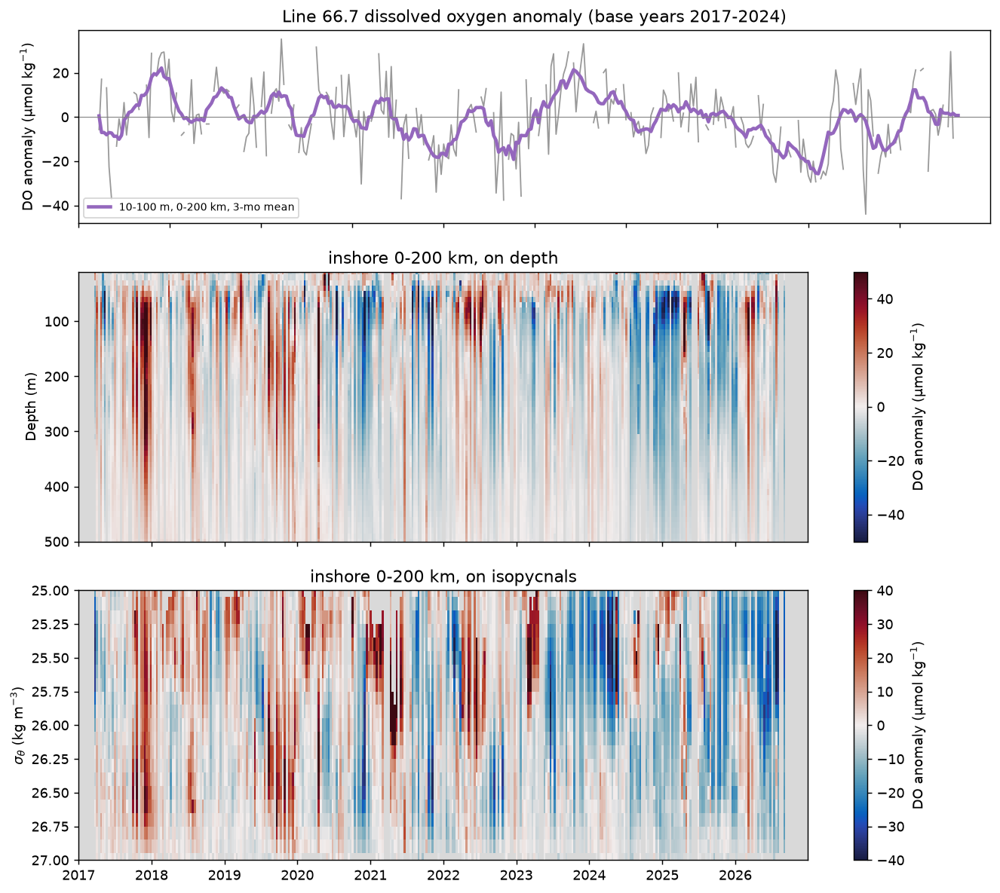
*Fig. 6. Line 66.7 dissolved-oxygen anomaly (2017–2024 base years): index (top),
inshore anomaly versus depth (middle) and versus σθ (bottom).*

## 6. The 2025–26 marine heatwave as prelude

NOAA's Blobtracker has followed a contiguous heatwave, NEP25A, off central
and southern California since **May 2025** [@cciea2026blobtracker]; a second
offshore feature, NEP26A, emerged in May 2026. The 2025–26 California Current
Ecosystem Status Report described 2025 as a year in which strong upwelling
kept the warm water offshore and productivity high [@cciea2026esr]; Fig. 2
shows exactly that on Line 66.7, with the anomaly reaching the inshore bins in
autumn 2025 and dominating them by February 2026. Along the coast, the Scripps
Pier and all ten Shore Stations set record daily SSTs through the summer of
2026 [@timesofsandiego2026super], Monterey Bay logged ~200 marine-heatwave
days in 2026 [@cbssf2026mhw], and Rudnick has described the Point Conception
and Monterey Bay glider lines as the warmest in 20 years [@cbs8_gliders_mhw].

**Satellite view (Figs 8, 9).** The OISST v2.1 anomaly for the seven days
ending 2 September 2026 [@huang2021oisst] averages **+0.9 °C over the whole
25–50 °N, 135–115 °W region and +0.9 °C along the Line 66.7 track**, with the
strongest anomalies, +3 to +4 °C, in the Southern California Bight and off Baja
California and a warm band of +1 to +2 °C offshore of central California. The
coastal strip from Point Conception to Cape Mendocino is near normal (the
Monterey Bay box averages **+0.5 °C**), the surface expression of the
above-normal summer upwelling seen in the CUTI/BEUTI indices (§8) and in the
thin upwelled cap of the latest transect (§4.4). In the Monterey Bay box, the
Hobday et al. (2016) analysis of the 1991–2020 baseline counts **155
marine-heatwave days out of 490 since 1 May 2025**, in six events: a
20-day event in late September–October 2025 (max +3.0 °C), a 67-day event
from 14 December 2025 to 18 February 2026, a 31-day event through April 2026,
and a **Strong** (category 2) event from 16 June to 7 July 2026 with a peak of
+3.2 °C above climatology on 24 June, coincident with the +3.9 °C glider
anomaly at 10 m in mid-June. On 2 September the box is +0.9 °C above
climatology and below the heatwave threshold; along the Line 66.7 track the
same-day anomaly is +1.2 °C. The intermittent character of
the coastal heatwave days, against the persistent subsurface warmth on the
glider line, is the point: satellite SST inshore is modulated by upwelling
week to week, while the heat content anomaly below the surface has not gone
away.

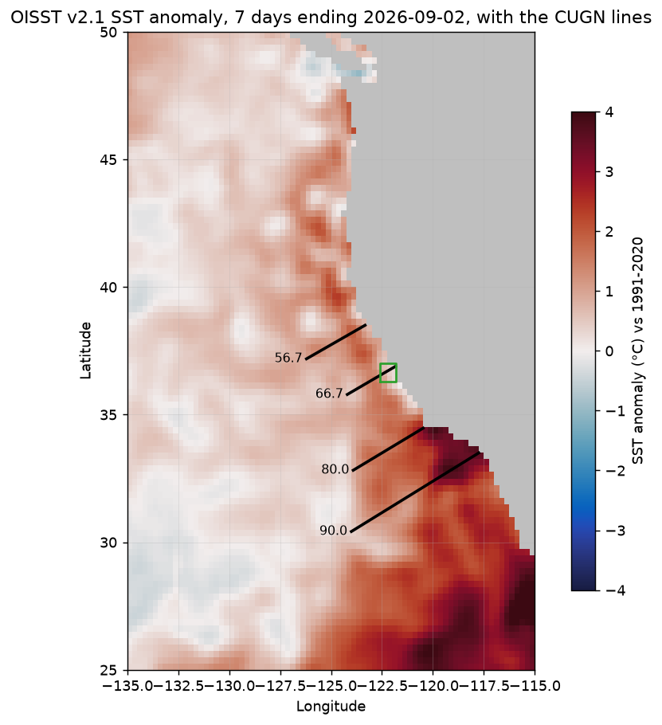
*Fig. 8. OISST v2.1 SST anomaly (vs 1991–2020) for the 7 days ending 2026-09-02,
with the CUGN lines (black) and the Monterey Bay box (green) used in Fig. 9.*

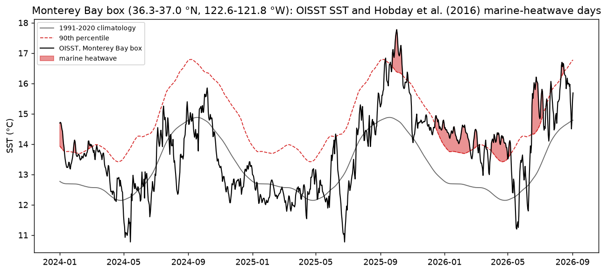
*Fig. 9. OISST SST in the Monterey Bay box (black) with the 1991–2020 daily
climatology (grey), the 90th-percentile threshold (red dashed) and Hobday et al.
(2016) marine-heatwave days (shaded), 2024–2026.*

The important point for interpretation is timing: the heatwave developed
while the equator was cool (weak La Niña in winter 2025–26) and Blobtracker's
19 August assessment is that the coastal warming is "not due directly to El
Niño". The El Niño, forecast to be very strong, arrives on top of it. Whether
the effects add or the heatwave simply hands off to El Niño-driven warming, as
Blobtracker expects, is the central question for the coming months.

## 7. Comparison with 2009–10, 2014–15 and 2015–16 (Fig. 7)

Overlaying the index by calendar month from July of the onset year (Fig. 7;
Table 1) gives:

| Event (from July of year 0) | Peak index | Month of peak | 10 m / 100 m / 200 m anomaly at peak (±45 d) | Depth where anomaly < +0.5 °C |
|---|---|---|---|---|
| 2009-10 El Niño | +1.06 °C | 2010-02 | +1.29 / +0.55 / +0.25 °C | 110 m |
| 2014-15 Blob | +1.39 °C | 2015-03 | +2.69 / +0.14 / +0.24 °C | 70 m |
| 2015-16 El Niño | +1.78 °C | 2016-02 | +2.03 / +0.80 / +0.32 °C | 120 m |
| 2025-26 MHW | +1.90 °C | 2026-04 | +2.42 / +1.01 / +0.53 °C | 230 m |
| 2026-27 El Niño | +1.41 °C | 2026-07 | +1.63 / +0.80 / +0.54 °C | 420 m |

*Table 1. Line 66.7 Temperature Index through the comparison events. The depth
structure is the inshore (0–200 km) mean anomaly averaged over ±45 days around
the index peak.*

Three points stand out. First, the **2025–26 heatwave already exceeded the
2015–16 El Niño on this index** (+1.90 vs +1.78 °C), peaking two months later
in the seasonal cycle (April vs February). Second, the index in **July–August
2026 (+1.3 to +1.4 °C) is higher than at the same stage of any previous event**,
including 2015, when Line 66.7 stood at +0.9 to +1.1 °C on top of the Blob.
Third, and unlike the Blob, the 2025–26 anomaly reaches deep: +1.0 °C at
100 m and +0.5 °C at 200 m at the peak, versus +0.1 and +0.2 °C for the Blob
and +0.8 and +0.3 °C for the 2015–16 El Niño. In its vertical structure the
current event therefore already looks more like an El Niño response than like
the 2014–15 heatwave, even though the equatorial forcing has only just
begun. (The 2026–27 row in Table 1 covers July–August 2026 only; the large
depth value reflects a weak +0.5 °C anomaly spread over the whole column.)

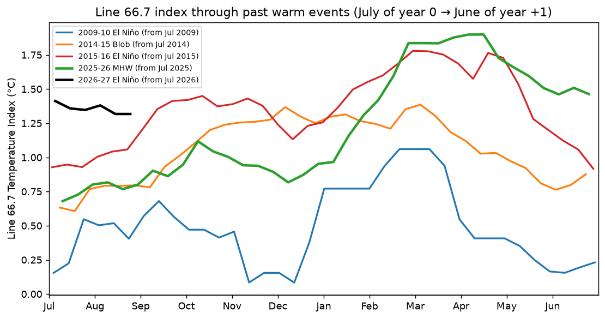
*Fig. 7. Line 66.7 Temperature Index for each event, aligned by calendar month
from July of the onset year.*

## 8. Regional context

**Upwelling (Fig. 10).** The CUTI and BEUTI indices at 36 and 37 °N
[@jacox2018cuti] have been **above normal since spring 2026** (90-day mean
anomalies of +0.3 to +0.45 m² s⁻¹ in CUTI and +2.2 to +2.6 mmol m⁻¹ s⁻¹ in
BEUTI through 30 August), after a short strongly negative spell in
March–April 2026 that coincides with the index peak. Above-normal summer
upwelling is consistent with the shallow cooling that has trimmed the surface
anomaly since May and with the near-normal surface layer in the latest
transect. A switch to persistently below-normal upwelling this autumn would be
one of the first atmospheric signs of El Niño at this latitude.

**Sea level (Fig. 11).** Detrended monthly sea-level anomalies at Monterey and
San Francisco were **+6.1 cm and +5.0 cm in July 2026** (relative to
1991–2020, trend 2.2 mm yr⁻¹ removed), already comparable to values reached at
the 2015–16 peak (+12 cm in late 2015) only in early 2026. The daily means from
hourly data show no arrival yet of the coastal Kelvin wave, which raised sea
level 9–14 inches in Central America in late August and is forecast to reach
San Francisco in early-to-mid October [@sfchronicle2026kelvin]. A step of
10–30 cm in the daily record in October–November, with a simultaneous
deepening of the σθ = 26 surface on Line 66.7, would mark the oceanic arrival
of El Niño.

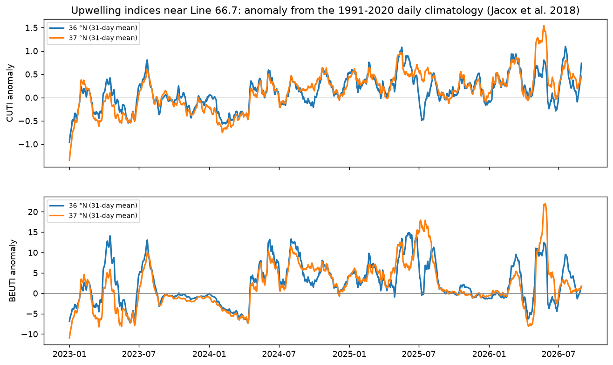
*Fig. 10. CUTI (top) and BEUTI (bottom) anomalies at 36 and 37 °N, 31-day means,
2023–2026.*

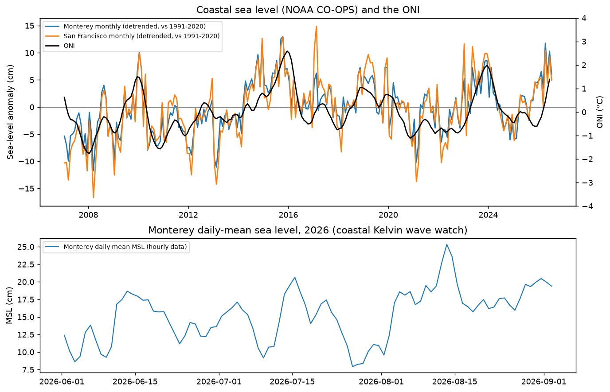
*Fig. 11. Top: detrended monthly sea-level anomaly at Monterey and San Francisco
with the ONI. Bottom: Monterey daily-mean sea level from hourly data, June–September
2026.*

## 9. Outlook: what to watch for in the October report

1. **Index direction.** The 3-month index has fallen from +1.9 to +1.3 °C
   since April. A renewed rise in September–October, against the seasonal
   tendency, would indicate the El Niño signal taking over from the heatwave.
2. **Depth penetration.** The inshore anomaly is already +0.8 °C at 100 m and
   the σθ = 26.0 surface is 23 m deeper than normal; a further drop of tens of
   metres in October–November, together with the sea-level step, would mark
   the Kelvin-wave arrival. The 2015–16 peak had +0.8 °C at 100 m.
3. **Sea level.** Kelvin-wave arrival expected in October; watch for the daily
   Monterey record to exceed the mid-August peak and for the monthly anomaly
   to pass +10 cm.
4. **Oxygen on isopycnals.** Whether the −30 µmol kg⁻¹ anomaly on σθ = 25.5
   persists or deepens as poleward flow strengthens.
5. **Upwelling.** A sustained negative CUTI/BEUTI anomaly.
6. **Equator.** The September CPC discussion (due 10 September) and whether the
   ONI for June–August crosses +1.5 °C, the "strong" threshold.
7. **Sampling.** `sp025` has been at sea since 11 June and will be recovered
   this autumn; the handover to the next mission should be watched so the
   Kelvin-wave arrival is not missed.

## 10. Methods and data provenance

**Glider data.** Delayed-mode, quality-controlled CUGN Line 66.7 data were
taken from the SprayData ERDDAP dataset `binnedCUGN66` (10-m bins, 10–500 m;
temperature, salinity, chlorophyll fluorescence, dissolved oxygen, acoustic
backscatter, velocities), downloaded in full on 2026-09-03 and stored as
`$OS_SPRAY/CUGN/Line_66/binnedCUGN66.nc` with a dated snapshot. Real-time
data for the mission at sea were taken from the IOOS Glider DAC ERDDAP
(`sp025-20260611T1755`, Level 2, full vertical resolution with QARTOD flags),
stored under `Line_66/DAC/`, and binned by us to the same 10-m grid. In the
real-time data we keep QARTOD flags 1 (good) and 2 (not evaluated) and drop
3, 4 and 9; the flag policy is a switch in `cugn.erddap.bin_dac_mission`
(`--strict-flags` in the build script keeps only flag 1). Real-time profiles
are used only for times after the last delayed-mode profile, so no mission is
counted twice. Along-line distance (km from the inshore end) and offset from
the line use the Line 66.7 endpoints in `cugn.utils.line_endpoints` and
`profiler.utils.offsets.calc_dist_offset`.

**Seasonal climatology and anomalies.** Following Rudnick et al. (2017), at
each 10-m depth and each 5-km cross-shore bin centre (0–400 km) we fit a
constant plus three annual harmonics (period 365.25 d) by weighted least
squares with a Gaussian cross-shore weight of e-folding width 15 km
(samples with weight < 10⁻³ dropped). Temperature uses the base years
**2008–2013**, the paper's choice for Line 66.7, which deliberately excludes
the 2014–16 warm years. Dissolved oxygen sensors give a reliable record only
from 2017, so the oxygen cycle uses **2017–2024** and excludes the 2025–26
heatwave; oxygen anomalies are therefore relative to a recent, already-warm
decade and are not directly comparable in baseline to the temperature
anomalies. The anomaly of each profile is the observation minus the fitted
cycle evaluated at the profile's time and distance (coefficients interpolated
linearly between bin centres). Anomalies are bin-averaged onto a 10-day ×
10-m × 5-km grid **without objective mapping**, so gaps in glider coverage
appear as gaps rather than being interpolated; this differs from the shipped
CUGN climatology products, which map the anomaly with 30-km/60-day Gaussian
covariances. Code: `cugn.annualcycle.fit_annual_cycle`,
`evaluate_annual_cycle`; `cugn.climatology.profile_anomalies`, `grid_profiles`.

**Line 66.7 Temperature Index.** Mean anomaly over 10–100 m and 0–200 km from
shore on the 10-day grid, smoothed with a centred 9-point (≈90-day) running
mean, mirroring the Southern California Temperature Index construction on the
spraydata El Niño page (upper 100 m, inshore 200 km, 3-month mean). Note that
the operational SCTI served on the SprayData ERDDAP is described in its
metadata as using Line 90 temperature at 50 m; the ONI overlay uses CPC's
official ONI table (ERSSTv5, rolling 30-year base periods), with Dan Rudnick's
detrended Niño-3.4 file also archived for parity with the spraydata figures.

**Isopycnal oxygen.** Potential density anomaly σθ (referenced to 0 dbar) is
computed with TEOS-10 (`gsw`: SA from practical salinity, CT from in-situ T);
this differs from the EOS-80 `sw_pden` used in the MATLAB pipeline by ~0.01
kg m⁻³, immaterial here. Oxygen and the depth of each surface are
interpolated onto σθ = 25.0–27.0 by 0.1, after enforcing monotonic density
with depth, and given their own harmonic seasonal fit and anomaly grid.

**Latest transect.** Legs of the active mission are found from turning points
of the along-line distance record; the most recent leg spanning at least 60 %
of the mission's cross-shore range is binned to 10 m × 5 km. Sections show
temperature, its anomaly and σθ contours (0.25 spacing, integers heavy),
offshore to the left as in Dan's `pxz.m`.

**Ancillary data.** OISST v2.1 daily SST [@huang2021oisst] for 25–50 °N,
135–115 °W, 1991–present, assembled from the CoastWatch ERDDAP aggregate plus
NCEI daily files for the most recent days (`data/SST/OISST/`); marine
heatwaves per Hobday et al. (2016): 1991–2020 daily climatology and 90th
percentile from an 11-day window, 31-day smoothed, 5-day minimum duration,
categories per Hobday et al. (2018). Official ONI and detrended Niño-3.4 from
CPC; SCTI from the SprayData ERDDAP; CUTI and BEUTI daily upwelling indices
[@jacox2018cuti] at 36 and 37 °N with anomalies relative to a smoothed
1991–2020 daily climatology; NOAA CO-OPS monthly mean sea level at Monterey
(9413450) and San Francisco (9414290) with anomalies relative to a 1991–2020
monthly climatology after removing the linear trend, and hourly water levels
from June 2026 for daily means. All under `$OS_CCS/`. Download dates: all
2026-09-03.

**Software.** `cugn` (this repository; modules `erddap`, `annualcycle`,
`climatology`, `indices`, `oisst`, `plotting`), `profiler`, `gsw` 3.6.23,
`cmocean` 3.0.3, xarray, pandas, matplotlib, cartopy, in the `ocean14` conda
environment (Python 3.14). Report products are rebuilt with
`reports/El_Nino_2026/scripts/build_products.py` and figures with
`make_report_figs.py --date <YYYY-MM-DD>`; `check_data_sources.py` reports
how current each source is. Synthetic-data tests: `cugn/tests/test_{annualcycle,
climatology,erddap,indices,oisst}.py`.

## 11. Update log

- **2026-09-03 (this report).** First issue. Built the Line 66.7 data pipeline
  (SprayData ERDDAP + Glider DAC), the 2008–2013 seasonal climatology and
  anomaly grids, the isopycnal oxygen products, the ancillary-data downloads
  (ONI, SCTI, CUTI/BEUTI, tide gauges, OISST) and the eleven figures. Data
  through 2026-09-03 (real-time) and 2026-06-09 (delayed mode).

## References

See `sources.md` for the annotated list with access dates and `sources.bib` for
BibTeX. Keys cited above: [@cpc2026aug] [@cpc2026strengths] [@iri2026aug]
[@noaa2026elninoforms] [@nasa2026kelvin] [@lian2026olar] [@ludescher2026arxiv]
[@rudnick2017climatology] [@zaba2016warming] [@jacox2016elnino] [@bond2015blob]
[@hobday2016mhw] [@hobday2018naming] [@huang2021oisst] [@jacox2018cuti]
[@cciea2026blobtracker] [@cciea2026esr] [@spraydata2026elnino] [@cugn66_binned]
[@ioosdac_sp025] [@timesofsandiego2026super] [@cbssf2026mhw] [@cbs8_gliders_mhw]
[@sfchronicle2026kelvin] [@gizmodo2026sealevel].
