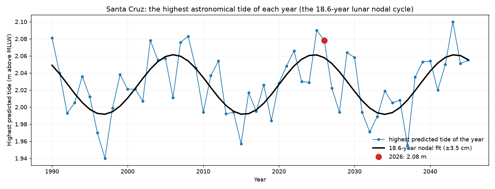
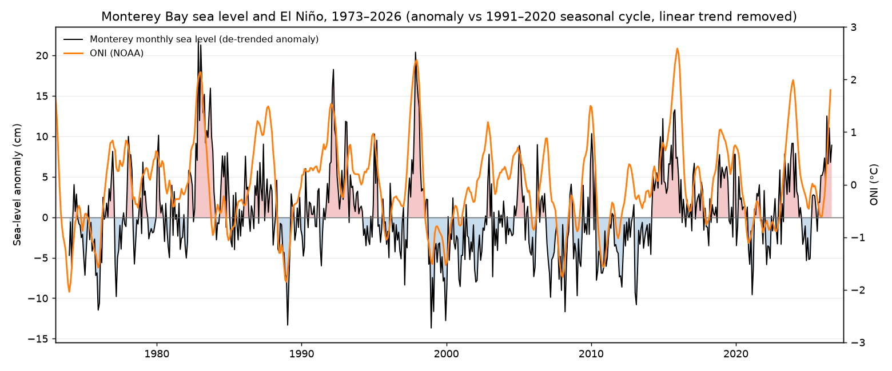
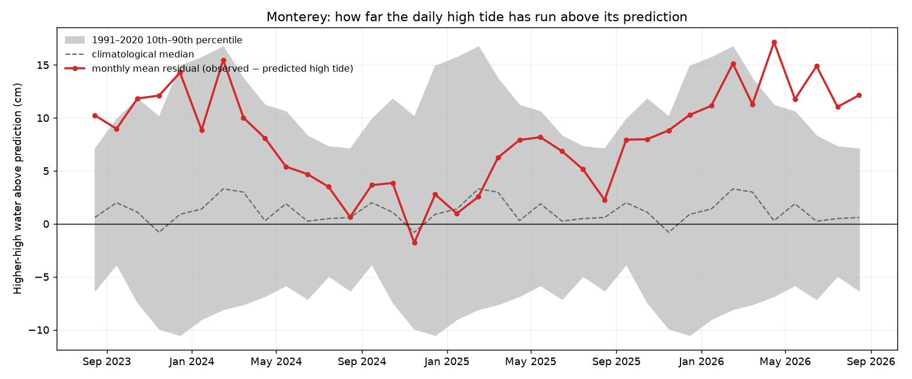
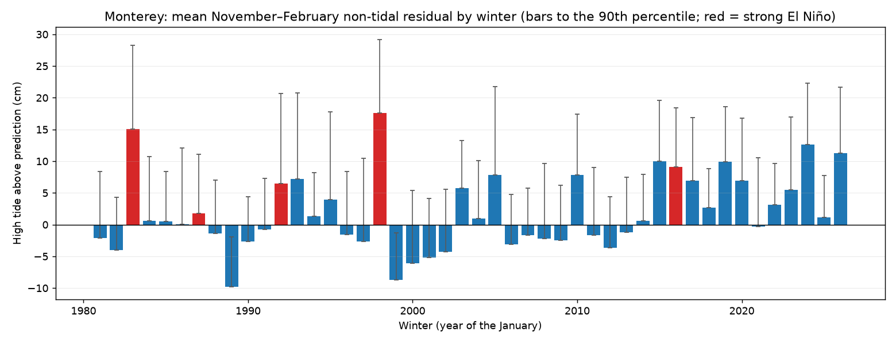
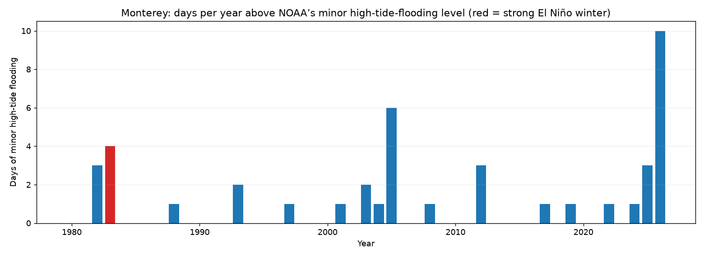
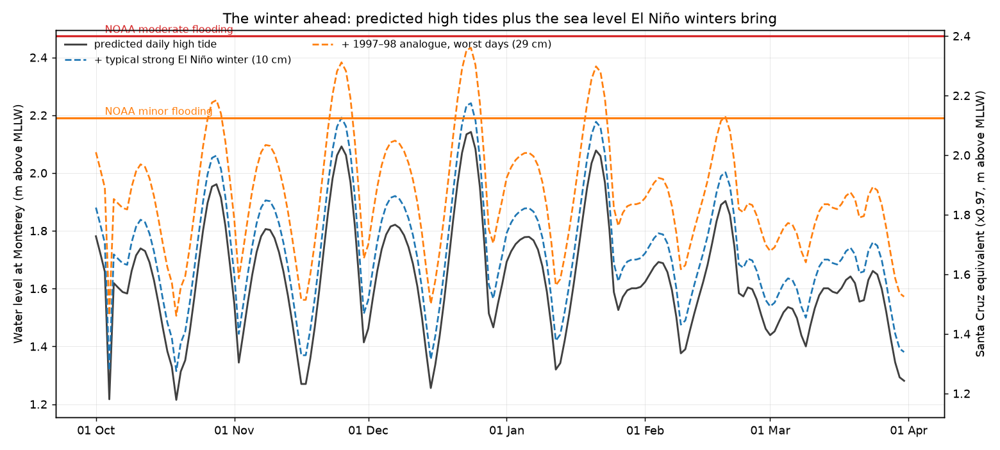

# Tides at the Santa Cruz Wharf and in Monterey Bay — September 2026

*UCSC Ocean Sciences · prepared for the 2026–27 El Niño report series ·
analysis script `scripts/santa_cruz_tides.py`, numbers in `tide_stats.json`*

---

## The short answer

**Yes — the water in Monterey Bay is standing higher than normal, but almost
none of that is the tide itself.**

The astronomical tide this winter is ordinary-to-slightly-large: we are near the
top of the 18.6-year lunar nodal cycle, which is worth only about **±3.5 cm** in
the height of the year's biggest tide. What has changed is the ocean underneath
the tide:

| | value | context |
|---|---|---|
| Monthly sea level, Aug 2026 | **+8.9 cm** above normal | 2nd-highest August in 53 years (behind Aug 1983, +13.1 cm) |
| Sea level, last 12 months | **+6.4 cm** | 42nd-highest of 622 twelve-month windows since 1973 |
| Daily high tide vs its prediction, last 12 months | **+11.6 cm** | climatology is +1.8 ± 8.3 cm; 223 of 365 days ran more than 10 cm high |
| Days above NOAA's minor flooding level in 2026 | **10** | the most of any year; 42 days in total since 1980 |
| Highest high water of the past year | **2.362 m** above MLLW, 3 Jan 2026 | 3rd-highest in the 47-year record, behind only 27–28 January 1983 |

So the high tides of the past year have been arriving on top of an ocean that is
roughly a hand's width higher than it used to be — about half of that from
long-term sea-level rise, about half from the current marine heatwave. **A strong
El Niño this winter would add roughly another 10 cm**, and that is enough to push
the Christmas-week king tides to NOAA's minor flooding level.

---

## 1. What "tides at the Santa Cruz Wharf" actually means

This turned out to be the first finding, and it shapes everything else.

NOAA station **9413745 "Santa Cruz, Monterey Bay"** (36.9583 °N, 122.0170 °W, on
the wharf) is a **subordinate station**: it publishes tide *predictions* only. It
has no water-level record, no tidal datums of its own, and no flood thresholds.
Its predictions are generated from the **Monterey gauge, 9413450** (36.6089 °N,
121.8914 °W, 25 km across the bay) using published offsets:

| | height ratio | time offset |
|---|---|---|
| High waters | ×0.97 | 6 minutes earlier |
| Low waters | ×0.99 | 11 minutes earlier |

The CeNCOOS shore station on the Santa Cruz wharf measures water properties —
temperature, salinity, harmful algal blooms — not water level. So **every
observation in this report comes from Monterey**, and Santa Cruz values are the
Monterey ones scaled by those offsets. For high waters the difference is 3 %:
a 2.19 m high water at Monterey is 2.13 m at the wharf.

Monterey's tidal datums (1983–2001 epoch, metres above MLLW): MHHW 1.63 m, MSL
0.86 m, MLLW 0.00 m. NOAA's high-tide-flooding levels there are **minor 2.19 m,
moderate 2.47 m, major 2.86 m** above MLLW (2.13 / 2.40 / 2.78 m in Santa Cruz
terms).

---

## 2. The astronomical tide: are the tides themselves bigger?

Slightly, and for a reason that has nothing to do with El Niño.

**Figure 1.** The highest predicted tide of each year at Santa Cruz. Individual
years are noisy — the annual maximum depends on whether a perigean spring tide
happens to fall near a solstice — but a least-squares fit at the 18.613-year
lunar nodal period (black) recovers a modulation of **±3.5 cm**, with its modelled
maximum in **mid-2024**. We are one to two years past the nodal peak, so the
astronomy is still near the top of its cycle and will slowly relax until the
2030s.

For the coming season the biggest predicted tide at Santa Cruz is **2.078 m above
MLLW on 24 December 2026 at 17:21** (2.142 m at Monterey). That is the highest
predicted tide of 2026 and the **second-highest of the 2020s**, behind 5 December
2025 (2.090 m) — which confirms, and slightly sharpens, the newsletter's line
about Christmas bringing one of the decade's highest tides.

The ten highest predicted tides at Santa Cruz this winter:

| date | predicted high water (m, MLLW) |
|---|---|
| 24 Dec 2026 | 2.08 |
| 23 Dec 2026 | 2.07 |
| 25 Nov 2026 | 2.03 |
| 25 Dec 2026 | 2.02 |
| 21 Jan 2027 | 2.02 |
| 22 Dec 2026 | 2.01 |
| 24 Nov 2026 | 2.00 |
| 26 Nov 2026 | 2.00 |
| 22 Jan 2027 | 2.00 |
| 20 Jan 2027 | 1.97 |

**None of these would flood anything on their own**: every one is below the
2.13 m Santa Cruz-equivalent minor flooding level. The tide is not the story.

---

## 3. The ocean underneath: sea level is high

**Figure 2.** Monthly mean sea level at Monterey, de-trended and referenced to
the 1991–2020 seasonal cycle, with NOAA's ONI. The two track each other closely:
the 1982–83, 1997–98 and 2015–16 El Niños are the three tallest excursions in the
record.

Fitting the 53 complete winters (Nov–Feb means) against the ONI gives

> **+4.5 cm of sea level per °C of ONI, r = 0.80 (n = 53 winters).**

At an ONI of +2 °C — the threshold of the "very strong" event the CPC gives better
than a 90 % chance of — that regression implies
roughly **+9 cm** of extra sea level — and the empirical composite of the five
strong El Niño winters in the gauge record (1983, 1987, 1992, 1998, 2016) gives
**+10 cm**, consistent with it.

The station's own long-term rise is **+1.8 mm/yr** over 1973–2026, modest by
global standards but not negligible: measured against the 1983–2001 tidal datum
epoch that the predictions use, it is already worth **+6.4 cm** of "extra" water
in every high tide today.

Right now, before El Niño has arrived at the coast, sea level at Monterey is
**+8.9 cm** (August 2026) — the second-highest August of the 53-year record, and
the past 12 months average **+6.4 cm**.

---

## 4. Observed minus predicted: the high tides are running high

The cleanest test of "are high tides higher than normal" is to compare each day's
observed higher-high water with what the tide tables said it should be. The
difference is the non-tidal residual: sea-level rise, the seasonal cycle's
departures, El Niño, storm surge and wind.

**Figure 3.** The daily high tide at Monterey relative to its prediction, monthly
means for the last three years against the 1991–2020 10th–90th percentile band.

Over the last 12 months the daily high tide has run **+11.6 cm above prediction**
on average, against a climatological +1.8 ± 8.3 cm, and **223 of 365 days** were
more than 10 cm high. Roughly speaking:

| contribution | size |
|---|---|
| Sea-level rise since the 1983–2001 datum epoch | ≈ +6.4 cm |
| This year's anomaly (marine heatwave, early El Niño) | ≈ +6 cm |
| Climatological residual baseline | +1.8 cm |
| **Observed last-12-month mean** | **+11.6 cm** |

(The three do not add exactly to the total — they are different statistics of the
same record — but they show where the water is coming from.)

**Figure 4.** Winter (Nov–Feb) mean residual by winter, with bars to the 90th
percentile; red marks the strong El Niño winters. The two great El Niños lead:
**1997–98 at +17.5 cm** (90th percentile +29 cm) and **1982–83 at +14.9 cm**
(+28 cm). The winter just past, 2025–26, reached **+11.1 cm** — fourth of the 47
winters in the record, and reached *without* an El Niño, on the strength of the
marine heatwave alone. The mean over all winters is +2.0 cm.

---

## 5. How often the water has actually reached flood level

**Figure 5.** Days per calendar year above NOAA's minor high-tide-flooding level
at Monterey, from NOAA's derived-product API. Counting days in this analysis's own
record of daily high waters reproduces those counts exactly, which is a useful
check on the method.

**2026 already holds the record with 10 days**, against 42 days in total over
1980–2026 — more than 1982 and 1983 combined (3 and 4 days) and more than the
previous worst year, 2005 (6 days). They came in three clusters:

| dates | highest high water (m, MLLW) | residual |
|---|---|---|
| 1–4 January 2026 | 2.362 (3 Jan) | +19 to +26 cm |
| 14–16 June 2026 | 2.286 (15 Jun) | +17 to +19 cm |
| 13–15 July 2026 | 2.290 (14 Jul) | +13 to +18 cm |

The January cluster is the more familiar kind — winter king tides with a storm
residual on top — and **3 January 2026 produced the third-highest high water of
the 47-year record, 2.362 m**, behind only 27 and 28 January 1983 (2.401 m and
2.398 m, on residuals of +36 and +33 cm) at the height of the great El Niño. The
June and July clusters are the unusual ones: summer king tides do not normally
reach flood level here, and they did this year only because the background ocean
was already high.

*A check on the method:* the highest water level this analysis finds in the whole
record, 2.401 m above MLLW on 27 January 1983, is exactly the station record NOAA
publishes in its datums metadata, and this analysis's count of days above the
minor flooding level reproduces NOAA's published high-tide-flooding counts year by
year.

### A caution: the tide is not what broke the wharf

On **23 December 2024**, when a 150-foot section of the Santa Cruz Wharf
collapsed during a high-surf event, the daily higher-high water at Monterey was
**1.49 m** — 0.70 m *below* the minor flooding level, with a residual of just
+5 cm. The damage was done by long-period swell, not by water level. Conversely
the highest tide of 2024 (14 December, above the minor flooding level) passed
without incident. Tide-gauge water level measures the still-water surface; wave
runup, which is what damages structures at the wharf, is a separate problem and
is not analysed here.

---

## 6. The winter ahead

**Figure 6.** Predicted daily high tides for the coming season (Monterey datum on
the left, Santa Cruz equivalent on the right), with two empirical scenarios added:
the average strong-El Niño winter residual from this record (+10 cm) and the
1997–98 analogue — the strongest winter in the record — at its 90th-percentile day
(+29 cm).

| scenario | peak water level (Monterey) | days above minor flooding, Oct–Mar |
|---|---|---|
| Tide prediction alone | 2.14 m | 0 |
| + typical strong El Niño winter (+10 cm) | 2.24 m | 2 |
| + 1997–98 analogue, worst days (+29 cm) | 2.43 m | 20 |

Reading that table:

- The predicted tide by itself never reaches flood level this winter.
- A typical strong El Niño residual puts the **Christmas-week tides (23–24
  December) over NOAA's minor flooding level**, with several other spring-tide
  runs within a couple of centimetres of it.
- A 1997–98-scale response would put water levels near **2.43 m on 20 days**,
  above the January 2026 high water, above the 1983 record of 2.401 m, and within
  4 cm of NOAA's *moderate* flooding level.

These are water levels, not damage forecasts: they exclude wave setup and runup,
which dominate at exposed sites like the wharf, and they exclude storm surge
beyond what the historical residuals already contain.

---

## 7. What to watch, and when

1. **October.** The coastal Kelvin wave now propagating up from the tropics is
   expected at San Francisco in early-to-mid October. It should appear at
   Monterey as a step up in the monthly mean and in the daily residual. If the
   residual jumps from ~+10 cm to ~+20 cm, the winter will be tracking 1997–98
   rather than 2015–16.
2. **22–25 December.** The season's highest astronomical tides, with 24 December
   the peak. Watch the residual in the days before.
3. **20–22 January 2027.** The second-highest run of the season, and the calendar
   window in which both 1983 and 2026 set their record high waters.
4. **Monthly.** Whether the 12-month mean sea level, now +6.4 cm, climbs toward
   the +13 to +14 cm of the 1983 El Niño peak.

---

## 8. Data and methods

* **Tide gauge:** NOAA CO-OPS [Monterey, station
  9413450](https://tidesandcurrents.noaa.gov/stationhome.html?id=9413450) —
  monthly means from 1973, verified high/low waters from 1980 (the high/low
  record begins in August 1979), all on MLLW.
* **Predictions:** CO-OPS harmonic predictions for [Santa Cruz, station
  9413745](https://tidesandcurrents.noaa.gov/noaatidepredictions.html?id=9413745)
  (subordinate) and for Monterey, 1990–2045.
* **Datums, offsets and flood levels:** CO-OPS metadata API; high-tide-flooding
  day counts from the derived-product API.
* **ONI:** NOAA CPC, via `cugn.indices.load_oni`.
* **Sea-level anomalies:** `cugn.indices.sea_level_anomaly` — 12 monthly means
  and a linear trend fitted jointly, climatology 1991–2020.
* **Script:** `reports/El_Nino_2026/scripts/santa_cruz_tides.py` (run in
  `ocean14`); every number quoted here is in
  `reports/El_Nino_2026/tides/tide_stats.json`.

**Caveats.** (i) Santa Cruz values are Monterey values scaled by NOAA's published
offsets; no water level is measured at the wharf. (ii) Predictions and datums
are on the 1983–2001 tidal epoch; when NOAA updates the epoch, the datums and
thresholds will shift and the residuals quoted here will drop by roughly the
sea-level rise between epochs. (iii) Flood thresholds exist only for Monterey.
(iv) Everything here is still water level: no wave setup, runup or overtopping.
(v) The 2026 observations after mid-summer include preliminary data.

*Preliminary results, September 2026. Next update October 2026, after the Kelvin
wave arrives.*
